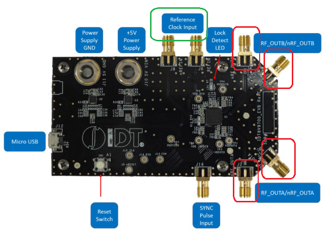
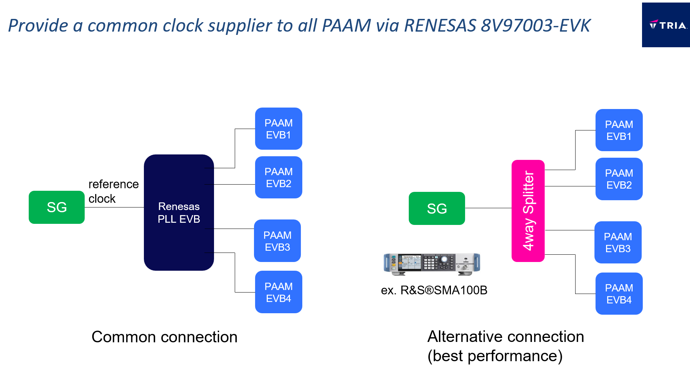

# Frequently Asked Questions (FAQ)

### __Question 1:__ [How do I find more detailed information on Fujikura PAAMs?](#answer-to-question-1)

### __Question 2:__ [Is there a phase alignment spec for the distribution of the 4 LOs from a single source?](#answer-to-question-2)

---

##  Answer to Question 1: How do I find more detailed information on Fujikura PAAMs?

For PAAM datasheets, characterization information, and application notes, an NDA is required.  
To request such an NDA, please submit your contact information using the form [here](https://www.avnet.com/wps/portal/us/products/avnet-boards/avnet-board-families/5g-mmwave-paam-development-platform/5g-mmwave-paam-platform-family) or send an email to **rfinfo@avnet.com**.

[Back to FAQ](#frequently-asked-questions-faq)

---

##  Answer to Question 2: Phase Alignment Spec for the Distribution of 4 LOs from a Single Source

If using the RENESAS 8V97003-EVK, an external 1:4 splitter is unnecessary as the EVK has four output ports (highlighted below in red).  
Instead, a reference clock input is required (green circle below). A low-noise signal generator (SG) is recommended for optimal performance.

For the best performance, if you have a low-noise SG at approximately 8 GHz, the alternative connection (shown below) is preferable.

There is no need to worry about phase differences between multiple PAAMs if you are creating independent beams with each PAAM.

[Back to FAQ](#frequently-asked-questions-faq)
