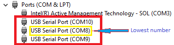
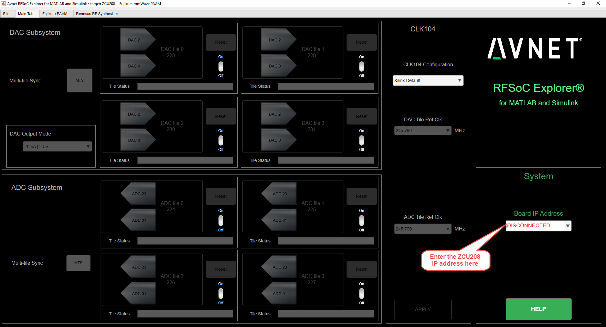
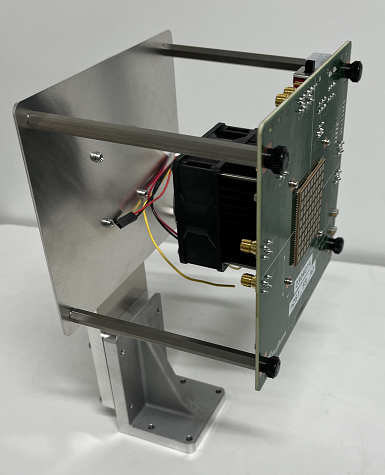
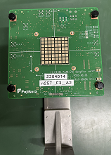
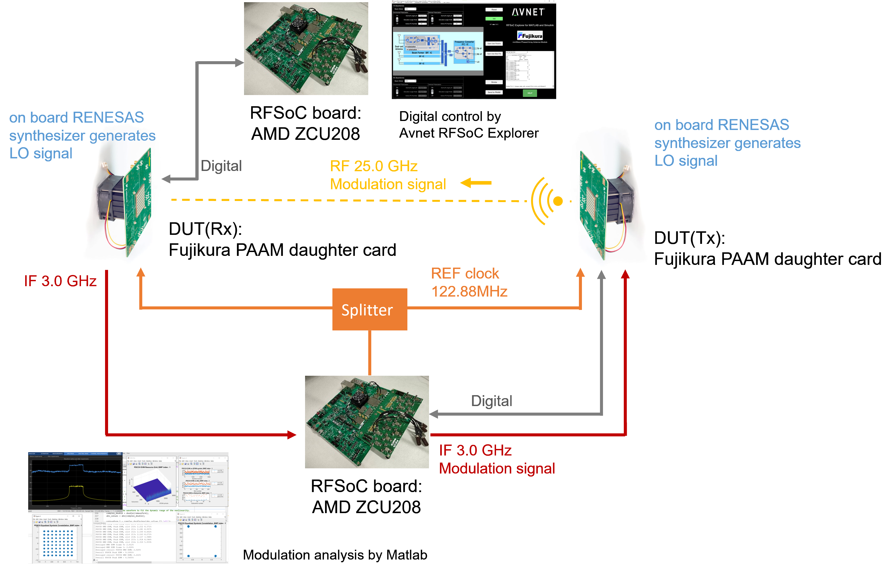

<table class="sphinxhide" width="100%">
 <tr width="100%">
    <td align="center"><h1><h1>
	5G mmWave PAAM Development Platform User Guide
    </td>
 </tr>
</table>

# Document Control

**Document Version:** 2.0

**Document Date:** 6/12/2024

# Version History

| Version |     | Date         |     | Comment                                               |     |
|---------|-----|--------------|-----|-------------------------------------------------------|-----|
| 1.1     |     | Jun 12, 2024 |     | Public release with RFSoC Explorer 3.1                |     |
| 1.0     |     | Dec 5, 2023  |     | Initial public release with RFSoC Explorer 3.0        |     |
|         |     |              |     |                                                       |     |
# Table of contents

1. [Overview](#1-overview)

2. [AMD ZCU208 Evaluation Board](#zcu208-board)

3. [uSD Card Preparation](#usd-card-preparation)

4. [Connecting the ZCU208 to your PC](#connecting-the-zcu208-to-your-pc)

    4.1. [Serial Port Connection](#41-serial-port-connection)

    4.2. [Getting the IP Address](#42-getting-the-ip-address)

    4.3. [Setting a Static IP Address](#43-setting-a-static-ip-address)

5. [Connecting the Fujikura PAAM Daughtercard](#connecting-the-fujikura-paam-carrier)

    5.1. [Connecting Power and the Digital Interface](#connecting-power-and-the-digital-interface)

    5.2. [Using the C# Test GUI (optional)](#using-the-c-test-gui-optional)

    5.3. [Connecting the Analog Path and Instruments](#connecting-the-analog-path-and-instruments)

6. [Using the CLK-104 Module](#using-the-clk-104-module)

7. [Installing MATLAB and Avnet RFSoC Explorer®](#installing-matlab-and-avnet-rfsoc-explorer)

    7.1. [Setting up Python Support in Matlab](#setting-up-python-support-in-matlab)
   
    7.1.1 [Setting the Python version in MATLAB](#setting-the-python-version-in-matlab)

8. [Testing the RFSoC Explorer Digital Interface](#testing-the-rfsoc-explorer-digital-interface)

    8.1 [ADC and DAC Control Tab ](#adc-and-dac-control-tab)
9. [Renesas 8V97003 18 GHz RF Synthesizer](#renesas-8v97003-18-ghz-rf-synthesizer)

10. [Fixture for the Daughtercard](#fixture-for-the-daughtercard)

    10.1 [Daughtercard installation on the fixing stand](#daughtercard-installation-on-the-fixing-stand)

11. [Over-the-air Testing with Rohde & Schwarz ATS800B compact antenna test range](#over-the-air-testing)

12. [Terminology](#terminology)

# Figures

Figure 1 – [5G mmWave PAAM Development Platform](#figure-1–5g-mmwave-paam-development-platform)

Figure 2 – [AMD ZCU208 Evaluation Board](#figure-2-amd-zcu208-development-board)

Figure 3 – [Completed boot sequence
[10](#_Ref141963341)](#_Ref141963341)

Figure 4 – [Ribbon cables between the ZCU208 and the PAAM Daughtercard
[14](#_Toc146045116)](#_Toc146045116)

Figure 5 – [Board User Interface to the CLK-104 Module
[20](#_Toc146045117)](#_Toc146045117)

Figure 6 – [Renesas 8V97003 RF Synthesizer in Fractional Mode
[25](#_Toc146045118)](#_Toc146045118)

Figure 7 – [Renesas 8V97003 RF Synthesizer in Integer Mode
[26](#_Toc146045119)](#_Toc146045119)

# 1) Overview <a name="1-overview"></a>

Avnet's [5G mmWave PAAM Development Platform](https://www.avnet.com/wps/portal/us/products/avnet-boards/avnet-board-families/5g-mmwave-paam-development-platform/) combines the [AMD ZCU208 evaluation kit](https://www.xilinx.com/products/boards-and-kits/zcu208.html) with the Fujikura PAAM Daughtercard.

AMD's ZCU208 Zynq UltraScale+ RFSoC evaluation kit features the [ZU48DR device](https://www.xilinx.com/products/silicon-devices/soc/rfsoc.html):

- **Cortex®-A53** core,

- **Cortex-R5** core and, amongst other peripherals, integrates

- eight 14-bit 5GSPS ADCs,

- and eight 14-bit 10GSPS\* DACs.

The Fujikura PAAM Daughtercard is an assembly that features

- the Fujikura PAAM as well as a number of peripherals, such as

- a programmable Renesas RF synthesizer

- an EEPROM,

- ADCs,

- a DAC.

- digital step attenuators for IF

<a name="figure-1–5g-mmwave-paam-development-platform"></a>


Figure 1 – 5G mmWave PAAM Development Platform

# 2) AMD ZCU208 Evaluation Board <a name="zcu208-board"></a>

For instructions on setting up the ZCU208, please refer to the [ZCU208
User Guide](https://docs.xilinx.com/v/u/en-US/ug1410-zcu208-eval-bd) and
the guide for [ZCU208 Software Install and Board
Setup](https://www.xilinx.com/support/documents/boards_and_kits/zcu208/2020_1/xtp607-zcu208-setup-c-2020-1.pdf).
Some relevant components for the instructions below are marked in this
diagram.

<a name="figure-2-amd-zcu208-development-board"></a>


Figure 2 – AMD ZCU208 Evaluation Board

<span class="mark">  
(1)</span> Marks the uSD card slot J23

<span class="mark">(2)</span> Marks the micro USB Type B serial cable
connector J24 that goes to the PC

<span class="mark">(3)</span> Marks the Ethernet cable connector P1

<span class="mark">(4)</span> Marks the power connector J50 and
<span class="mark">(5)</span> marks the power ON/OFF switch SW15

<span class="mark">(6)</span> Marks the FMC+ connector J28 for the
adapter card for cabling to the Fujikura card

# 3) uSD Card Preparation <a name="usd-card-preparation"></a>

A Micro SD (uSD) card ships with the ZCU208. A different uSD card can be
used, but it is important to know that some uSD cards do not work well
with AMD development boards. Please consult [this
link](https://support.xilinx.com/s/article/66779) for list of SD cards
that have been tested with Zynq UltraScale+ MPSoC.

Follow these steps to load a custom SD card boot image for the ZCU208,
allowing it to control the Fujikura PAAM Daughtercard via RFSoC
Explorer.

1.  Remove the SD card from slot J23 on the ZCU208 and insert into your
    PC. Then format it as FAT using a tool like [SD Memory Card
    Formatter](https://www.sdcard.org/downloads/formatter_4/).

2.  Download the boot image archive zip file from the public repository
    at [ZCU208 uSD
    Card](https://github.com/Avnet/Fujikura-beamforming/releases/tag/3.0.0).

3.  Unzip the archive to the root level of the SD card.  
    

4.  Safely eject the SD card from the PC and replace it in the J23 slot
    on the ZCU208.

#  4 Connecting the ZCU208 to your PC <a name="connecting-the-zcu208-to-your-pc"></a>

## 4.1 Serial Port Connection <a name="41-serial-port-connection"></a>

Connect a micro USB Type B to USB Type A serial comms cable between J24
on the ZCU208 and a USB port on your PC.

If your PC does not automatically detect the new COM ports associated
with the ZCU208, you should consult the guide for [ZCU208 Software
Install and Board
Setup](https://www.xilinx.com/support/documents/boards_and_kits/zcu208/2020_1/xtp607-zcu208-setup-c-2020-1.pdf).

In summary:

1.  If your PC does not automatically detect and enumerate new COM ports for the ZCU208, you may need to install [FTDI Virtual COM Port (VCP) drivers](https://ftdichip.com/drivers/vcp-drivers/).

2.  Three new COM ports for the ZCU208 should appear in the Windows
    Device Manager. Each of these COM ports should show that it is using
    the FTDI driver:  
    

3.  These 3 COM ports are usually in numerical order and it is important
    that of these 3 ports, you select the COM port with the lowest value
    when connecting to the serial port for the Zynq device on the
    ZCU208. Here that port is COM8, but on your PC it could be 3 other
    numbers that show up, and you should pick the lowest one.  
      
    

4.  Open a serial terminal emulator (e.g. TeraTerm) on your PC.  
    Make sure you **select 115200 as the Baud rate** and that you picked
    the correct COM port.  
      
    

5.  Connect the ZCU208 power supply to an outlet and to connector J50.
    Then power ON the board using SW15.

6.  The serial terminal emulator should start showing the boot log as
    below.  
    

7.  When the boot process completes, this should be the output. Note
    that the displayed IP address will not necessarily be one that can
    be used. **We will discuss setting the IP address in the next
    section**.  
      
    

<span id="_Ref141963341" class="anchor"></span>Figure 3 – Completed boot
sequence

##  4.2 Getting the IP Address <a name="42-getting-the-ip-address"></a>

1.  Connect an Ethernet cable from P1 on the ZCU208 to the local network
    that your PC is on.

2.  On the serial port terminal that is shown in Figure 3, hit Enter so
    that a login prompt will be shown. Enter **root** for the login name
    and then again **root** for the password.

3.  Enter **ifconfig** . Note the IP address, since you will use this
    address to connect to the board from your PC.  
    

4.  From a Command Prompt on your PC, verify that you can connect to the
    ZCU208 by pinging the IP address
    above.

## 4.3 Setting a Static IP Address <a name="43-setting-a-static-ip-address"></a>

1.  If you intend to connect the ZCU208 to an Ethernet port on your PC
    directly, you may have to edit the **autostart.sh** file on the
    ZCU208’s uSD card first.

2.  Power the ZCU208 off using SW15 and remove the uSD card from its
    slot, J23.

3.  Insert the uSD card into your PC and open **autostart.sh** in a text
    editor.  
    Note: **Make sure you are using a Linux-compatible editor like
    Notepad++ so that lines are terminated with a LF character only**.

4.  Set **USE_DHCP=false**  
    

5.  Safely eject the SD card from the PC and replace it in the J23 slot
    on the ZCU208 and turn the ZCU208 power switch SW15 ON

6.  The application auto-start function creates an IP connection for the
    board at an address like 169.254.10.2. To use a different IP
    address, simply modify the IPADDR field in the autostart.sh file.  
    

7.  Set a static IP for your host PC’s Local Ethernet adapter. Make sure
    your PC and the board are on the same subnet and gateway. See the
    example below.


#  5 Connecting the Fujikura PAAM Daughtercard <a name="connecting-the-fujikura-paam-carrier"></a>

## 5.1 Connecting Power and the Digital Interface <a name="connecting-power-and-the-digital-interface"></a>

Some relevant components for the instructions below are marked in this
diagram.


<span id="_Toc146045116" class="anchor"></span>Figure 4 – Ribbon cables
between the ZCU208 and the PAAM Daughtercard

<span class="mark">(1)</span> Marks the ZCU208 power ON/OFF switch SW15

<span class="mark">(2)</span> Marks the fan power header CN14

<span class="mark">(3)</span> Shows the EVK Conversion Card plugged into
the FMC+ connector J28 on the ZCU208

<span class="mark">(4)</span> Marks the two ribbon cable assemblies with
the FireFly connectors

<span class="mark">(5)</span> Marks the Ach connectors CN1 on the
Conversion Card and on the PAAM Daughtercard

<span class="mark">(6)</span> Marks the Bch connectors CN3 on the
Conversion Card and on the PAAM Daughtercard

<span class="mark">(7)</span> Marks the Daughtercard power connector
CN10

<span class="mark">(8)</span> Marks the Daughtercard power ON/OFF switch
SW1

1.  Make sure to power off the ZCU208 first, using the ON/OFF switch
    SW15.

2.  On the PCB side that is opposite to the where the PAAM is mounted\*,
    there is a large cooling fan\*\* with a 3-wire cable assembly (red,
    black and yellow). The red and black wires end in a 2-position
    header socket, while the yellow wire is not used. Push this header
    socket onto CN14 that is marked “**FAN**”. The black side goes to
    the GND pin, next to the SMA connector CN7, while the red side goes
    to the 12V pin\*\*\*.

3.  Plug the **Fujikura PAAM EVK Conversion Card** into J28, the FMC+
    connector on the ZCU208. Two screws can be used to secure it if
    necessary.

4.  Two ribbon cable assemblies with [Samtec FireFly
    connectors](http://suddendocs.samtec.com/notesandwhitepapers/samtec-firefly-copper-instructions.pdf)
    are used to transfer the digital signals between the EVK Conversion
    Card and the PAAM Daughtercard.  
    

[This short video](https://vimeo.com/83851017) (at 0:58) also shows how
this is done.

5.  There are two ribbon cables. First connect CN1 (marked Ach) on the
    EVK Conversion Card to CN1 (also marked Ach) on the PAAM Daughtercard.

6.  Then connect CN3 (marked Bch) on the EVK Conversion Card to CN3
    (also marked Ach) on the PAAM Daughtercard.

7.  Connect the 12V power supply that comes with the PAAM EVK to CN10 on
    the PAAM Daughtercard.

8.  First turn on the ZCU208 power supply. Then turn on the Daughtercard
    power supply with its ON/OFF switch SW1. The fan should make a loud
    noise, indicating that it works.

NOTE

\* Do not touch the PAAM surface. If the antenna is scratched, the
expected performance may not be achieved.

\*\* Do not remove the heatsink. If the heatsink is removed even once,
the heat dissipation performance cannot be guaranteed.

\*\*\*Incorrect connection will short the power supply.

##  5.2 Using the C# Test GUI (optional) <a name="using-the-c-test-gui-optional"></a>

Avnet created a custom test utility that can be used to verify that the
peripherals on the Fujikura PAAM Daughtercard work correctly. These
peripherals are:  

- The power supply regulators

- An EEPROM for storing board parameters and version information

- Five attenuators (4 for the Tx and Rx H and V paths and one for the
  PLL output)

- A 4-channel DAC for setting trim values for the power supply rails

- Four 8-channel ADC’s

- A Renesas 8V97003 PLL for creating the LO if an external input is not
  provided

A Linux utility, **fjk_tcp**, runs on the ZCU208 and processes
communications from a host in the form of JSON strings via Ethernet port
8083. It is important to note that **only one host utility**, i.e.
either RFSoC Explorer or the C# GUI, **can use that port**. So only one
of the two can be used at a time.

A link for downloading the C# test utility can be requested from Avnet.
It consists of a single Windows executable and two Newtonsoft files for
JSON support. They can be stored anywhere on your PC.


The utility can be run by double-clicking **Fujikura TCP Host.exe**.
When the program closes, a **Fujikura TCP Host.ini** file that stores
some of the user’s selections is saved in the same directory.

Make sure that the ZCU208 is booted, as shown in Figure 3.

The first time you run the C# GUI, you will have to enter the ZCU208 IP
address, before clicking **Open TCP Port**.


On the “Power and Attenuation” tab that opens, click **Get Versions**
and make sure you receive a response.


All communication with the ZCU208 is via JSON strings. Note that you can
see a history of commands and responses on the **Comms** tab. You can
clear the history by clicking on **Clear Text Boxes**.


Un-checked boxes mean that the status is unknown. If you close the GUI
and re-start it, you can request the ZCU208 status by clicking the
**Read Status** button. If a value was previously set, it should show in
the GUI.

##  5.3 Connecting the Analog Path and Instruments <a name="connecting-the-analog-path-and-instruments"></a>

TBD

#  6 Using the CLK-104 Module <a name="using-the-clk-104-module"></a>

The ZCU208 kit includes a CLK-104 module that plugs into J101. There are
a few clock sources on this module and the LMK04828 output is available
as OUTPUT_REF on the J10 SMA connector. This can be connected to the PLL
input REF_EXT, which is CN12 on the Fujikura Daughtercard.

The LMK04828 is managed by a TI MPS430 System Controller. The user
interface to the System Controller is via one of the USB serial ports
(one of those ports is used for the Linux terminal).

The software used for this interface is the **ZCU208 Board User
Interface**. The installer  
**rdf0562-zcu208-bit-c-2020-1.zip** can be downloaded from  
<https://www.xilinx.com/products/boards-and-kits/zcu208.html#documentation>
.


After unzipping the file, run .\zcu208_bit\\ BoardUI\\**BoardUI.exe**.

Under File/Select the system controller port, select a port. Typically,
this enumerates as the highest number of the 3 ZCU208 USB COM ports.

The way to make sure that communications with the CLK-104 module works
is to click **Check-CLK-104**.


We want to program the LMK04828 to output 122.88MHz. This is done as
follows:

- In the release directory there is a file  
  ZCU208 CLK-104
  Card\\**245M76_PL_122M88_SYSREF_7M68_OUTREFCLK_122M88_TCS.txt**

Place this file in the folder  
.\zcu208_bit\BoardUI\tests\ZCU208\\**clockFiles\lmk04828**\\

- As in the diagram below, select the LMK04828 file to program.

- The clock can be reset (turned off) by clicking **Reset LMK04828**.

- The clock can be programmed by clicking **Set LMK04828 Params**. While
  being programmed, the D10 LED on the CLK-104 card will go off, briefly
  flash a few times and then stay on.


<span id="_Toc146045117" class="anchor"></span>Figure 5 – Board User
Interface to the CLK-104 Module

#  7 Installing MATLAB and Avnet RFSoC Explorer® <a name="installing-matlab-and-avnet-rfsoc-explorer"></a>

Avnet RFSoC Explorer provides native connection to MATLAB ® and Simulink
®, featuring graphical control of the platform and intuitive APIs for
programmatic access.


Your computer will need the following MathWorks software.

- MATLAB ([supported
  versions](https://www.mathworks.com/matlabcentral/fileexchange/73665-avnet-rfsoc-explorer))

- DSP System Toolbox

- Fixed-Point Designer

- Communications Toolbox

- Signal Processing Toolbox

- Install one of the following support packages from the MATLAB Add-On
  Manager

<!-- -->

- Communications Toolbox Support Package for Xilinx Zynq-Based Radio

- HDL Coder Support Package for Xilinx RFSoC Devices

- SoC Blockset Support Package for Xilinx Devices

Optional toolboxes for working with standards-compliant waveforms in
RFSoC Explorer

- LTE Toolbox (optional)

- 5G Toolbox (optional)

[Get a Free MATLAB Trial Package for
RFSoC](https://www.mathworks.com/rfsoc)

RFSoC Explorer installs easily using the MATLAB Add-Ons store.

1.  From **MATLAB \> Add-Ons**, search for **Avnet RFSoC Explorer** and
    click install

2.  From **MATLAB \> Add-Ons**, search for **Communications Toolbox
    Support Package for Xilinx Zynq-Based Radio** and click install

3.  If prompted, click **Setup Later**


## 7.1 Setting up Python Support in Matlab <a name="setting-up-python-support-in-matlab"></a>

RFSoC Explorer has been tested with [Python
3.9.13](https://www.python.org/downloads/release/python-3913/), but
earlier/later releases may also work.

After installing Python, the following commands are needed to install
the support libraries that are being used:

> py -m pip install --user --upgrade pip
>
> py -m pip install pyserial
>
> py -m pip install numpy
>
> py -m pip install spectrum
>
> py -m pip install pandas
>
> py -m pip install openpyxl
>
> py -m pip install pyvisa

###  7.1.1 Setting the Python version in MATLAB <a name="setting-the-python-version-in-matlab"></a>

1.  First, check whether the correct Python version is supported in your
    MATLAB installation by entering:
```
>> pyenv

ans =
    PythonEnvironment with properties:
       Version: "3.9"
    Executable: "C:\Users\Name\AppData\Local\Programs\Python\Python39\python.exe"
       Library: "C:\Users\Name\AppData\Local\Programs\Python\Python39\python39.dll"
          Home: "C:\Users\Name\AppData\Local\Programs\Python\Python39"
        Status: NotLoaded
 ExecutionMode: InProcess
```
The response above is for a valid Python environment; the important
property is 'Executable'.

2.  **If these are not as expected**, enter:
```
>> [~, exepath\] = system("where python")

    exepath =
    C:\Users\Name\AppData\Local\Programs\Python\Python39\python.exe
    C:\Users\Name\AppData\Local\Microsoft\WindowsApps\python.exe
```

The valid path to the version 3.9 executable is in 'Python39' folder.

3.  Now enter (using the valid path above):
```
>> pyenv('Version', 'C:\Users\Name\AppData\Local\Programs\Python\Python39\python.exe')

ans =
    PythonEnvironment with properties:
       Version: "3.9"
    Executable: "C:\Users\Name\AppData\Local\Programs\Python\Python39\python.exe"
       Library: "C:\Users\Name\AppData\Local\Programs\Python\Python39\python39.dll"
          Home: "C:\Users\Name\AppData\Local\Programs\Python\Python39"
        Status: NotLoaded
 ExecutionMode: InProcess
```

# 8) Testing the RFSoC Explorer Digital Interface <a name="testing-the-rfsoc-explorer-digital-interface"></a>

In MATLAB, enter:
```
>> Avnet_RFSoC_Explorer('startup', 'board_id', 7)
```

This should bring up the RFSoC Explorer GUI. If you have not connected
to a ZCU208 before, the IP address should be red and “DISCONNECTED, as
below’.



If you have entered an IP address before, the utility will try to
connect automatically. If connection was successful, the IP address will
be black,  
  
and it will be available in the drop-down for future sessions.


Once connected:

1.  Go to the **Fujikura PAAM** tab.

2.  Click **<span class="mark">Init</span>** .

3.  RFSoC Explorer should now start using Python scripts and JSON
    messages to initialize the PAAM Daughtercard. If it cannot
    communicate with the PAAM, you will get a dialog to apply PAAM
    power. Make sure that the Daughtercard power ON/OFF switch SW1 is in
    the ON position (towards CN14) so that you can hear the fan. Then
    click **OK** to continue.


4.  RFSoC Explorer should now continue initializing the PAAM. This can
    take 40 seconds to complete.


5.  When initialization is complete, the dialog box will display the
    steps taken, followed by **Successfully initialized PAAM
    Daughtercard with default settings** and the printout from committing those settings to the PAAM.


6.  You can now make changes to some PAAM controls. In the image
    below Tx Vertical Polarization is turned on and the DSA value is
    changed to 5. Note that the **<span class="mark">Send to
    PAAM</span>** button has turned green. These changes on the GUI will
    only take effect on the hardware once **Send to PAAM** is clicked.


7.  Send to PAAM will turn grey again and updated PAAM settings will be
    displayed in the dialog box, and the image of the PAAM will be updated to show the active elements on the array.


8. If you wish to see the 2D elevation and azimuth plots or a 3D plot which approximate the beampattern of an array of 5G antenna elements, check the boxes next to the 2D/3D Beam Angle Plot text before sending the settings to the PAAM. 
   
    > NOTE: Both the [Phased Array System Toolbox](https://www.mathworks.com/products/phased-array.html) and the [Antenna Toolbox](https://www.mathworks.com/products/antenna.html?s_tid=srchtitle_site_search_2_antenna%2520toolbox) must be installed to create plots.


## 8.1 ADC and DAC Control Tab <a name="adc-and-dac-control-tab"></a>
    
The Fujikura PAAM Daughtercard includes the ability to measure and adjust all system voltage rails by way of onboard ADCs and DACs. The ADC/DAC tab allows for reading ADC values and writing DAC values. As part of a successful initialization of the PAAM by Avnet RFSoC Explorer, default values will be written to enable the DAC channels.

After successfully initializing the Fujikura PAAM daughtercard, the "Read ADCs" button will turn red, indicating that the ADC channels are available for reading. Reading the ADC values before initialization will not guarantee correct readback.

Each of the rails has a text field in which to enter the desired output voltage, which will then send a command to the app running on the AMD Zynq RFSoC Processing Subsystem (PS) to set the appropriate trim value.

> NOTE: Most users will not need to adjust the DAC values.


# 9) Renesas 8V97003 18 GHz RF Synthesizer <a name="renesas-8v97003-18-ghz-rf-synthesizer"></a>

The Fujikura PAAM Daughtercard can connect an external signal through
SMA connector (<span class="mark">CN7</span>) to provide the local
oscillator (LO) to the PAAM FCIC for up/down conversion between the
intermediate frequency of the ZCU208 RFSoC DAC/ADC in TX/RX operation.

Alternatively, an on-board Renesas 8V97003 RF synthesizer (aka ‘PLL’)
can generate the LO for autonomous operation of the system.

The RF synthesizer is fully programmable in fractional or integer
modes. See [Renesas 8v97003 Performance optimization guidelines](https://www.renesas.com/us/en/document/apn/8v97003-performance-optimization-guidelines)

Avnet RFSoC Explorer will adjust the PLL feedback parameters
and the IF frequency to meet the desired RF frequency, as per the
following equations:

> $$Fpfd = PLL\ input\ frequency \times \frac{2^{PLL\ input\ doubler(D)}}{PLL\ Input\ divider(R)}$$
>
> $$VCO\ frequency = Fpfd\  \times \left( N_{integer} + N_{fractional}/MOD \right)$$
>
> $$RF\ frequency = VCO\ frequency\  \times 4 + IF\ frequency$$


<span id="_Toc146045118" class="anchor"></span>Figure 6: Renesas 8V97003
RF Synthesizer in Fractional Mode

Example RF synthesizer settings in fractional mode for desired RF frequency
= 28 GHz:

| *RF Frequency*             | 28.000 GHz  | Desired RF frequency, set by user                     |
|----------------------------|-------------|-------------------------------------------------------|
| *PLL input frequency*      | 122.880 MHz | Set by user                                           |
| *PLL input doubler(D)*     | On          | Set by user                                           |
| *PLL input divider(R)* = 1 | 1           | Set by user                                           |
| *IF Frequency*             | 3.00000 GHz | Adjusted by RFSoC Explorer for desired RF frequency   |
| *VCO Frequency*            | 6.25000 GHz | Calculated by RFSoC Explorer for desired RF frequency |


<span id="_Toc146045119" class="anchor"></span>Figure 7: Renesas 8V97003
RF Synthesizer in Integer Mode

Example RF synthesizer settings in integer mode for desired RF frequency
= 28 GHz:

| *RF Frequency*             | 28.000 GHz  | Desired RF frequency, set by user                     |
|----------------------------|-------------|-------------------------------------------------------|
| *PLL input frequency*      | 122.880 MHz | Set by user                                           |
| *PLL input doubler(D)*     | On          | Set by user                                           |
| *PLL input divider(R)* = 1 | 1           | Set by user                                           |
| *IF Frequency*             | 3.42400 GHz | Adjusted by RFSoC Explorer for desired RF frequency   |
| *VCO Frequency*            | 6.14400 GHz | Calculated by RFSoC Explorer for desired RF frequency |

# 10) Fixture for the Daughtercard <a name="fixture-for-the-daughtercard"></a>

## 10.1 Daughtercard installation on the fixing stand <a name="daughtercard-installation-on-the-fixing-stand"></a>

The Fujikura PAAM Daughtercard can be used with the fixing stand to
measure RF characteristics if necessary. **Securely fix the fixing stand
to your measurement system before connecting some coaxial cables and
power cable. If the installation work is carried out while the fixing
stand is not sufficiently fixed, the evaluation board may tip over and
damage the operator or your property.**



1.  Attach the 4 hexagonal posts to the fixing base using screws with a
    tightening torque of **0.315 N·m** (red circle).\*

2.  Attach the Daughtercard to the hexagonal post attached to the fixing
    stand using screws with cap.




NOTE

\*If the fixing stand screws shown in picture are loose (blue circle,
yellow circle), retighten them with a tightening torque of **0.315 N·m
for blue circle or 0.75 N·m for yellow circle**.

CAUTION

The radio waves emitted from the PAAM may have a negative effect on the human body, so do not stand within a 1 m radius in front of the PAAM while radio waves are being emitted.

# 11) Over-the-air Testing with Rohde & Schwarz ATS800B compact antenna test range (CATR) <a name="over-the-air-testing"></a>

Over-the-air testing was conducted with [Rohde & Schwarz ATS800B compact antenna test range (CATR)](https://www.rohde-schwarz.com/ca/products/test-and-measurement/antenna-test-systems-and-ota-chambers/rs-ats800b-catr-benchtop-antenna-test-system_63493-642314.html)

# TX EVM Measurement


# Opposite EVM Measurement(2 kits)


Measurements in the lab can be automated through MATLAB scripts for control of:
- parameters of AMD Zynq™RFSoC direct-RF data converters including sampling rate, complex mixer, decimation/interpolation filters, on-chip PLL for each tile (ref: [RFSoC RF Data Converter Product Guide](https://docs.xilinx.com/r/en-US/pg269-rf-data-converter))
- digital waveform streaming through direct-RF DACs, with seamless waveform generation through from [5G ToolBox from MathWorks](https://nl.mathworks.com/products/5g.html)
- Fujikura PAAM Daughtercard parameters including DSA, BFIC phase & gain control / beam weights and [Renesas 8V97003 18 GHz RF Synthesizer](#renesas-8v97003-18-ghz-rf-synthesizer) for LO
- automated measurements such as frequency, power sweeps with Rohde & Schwarz instruments [FSW43 Signal and spectrum analyzer](https://www.rohde-schwarz.com/us/products/test-and-measurement/benchtop-analyzers/rs-fsw-signal-and-spectrum-analyzer_63493-11793.html), [SMW200A vector signal generator](https://www.rohde-schwarz.com/uk/products/test-and-measurement/vector-signal-generators/rs-smw200a-vector-signal-generator_63493-38656.html) and [ZNA vector network analyzer](https://www.rohde-schwarz.com/ca/products/test-and-measurement/network-analyzers/rs-zna-vector-network-analyzers_63493-551810.html)


Learn more:
- [Optimizing EVM Measurements in 5G FR2 Phased Array Antenna Modules](https://event.on24.com/eventRegistration/EventLobbyServlet?target=reg20.jsp&eventid=4081674&sessionid=1&key=8F7DD91FEDF473E6FFEBE19EAF860D84&groupId=4455870&sourcepage=register)
- [IMS2023 San Diego with Fabrício Dourado, application engineer at Rohde & Schwarz](https://www.avnet.com/wps/portal/us/products/avnet-boards/avnet-board-families/5g-mmwave-paam-development-platform/)
- [Prototype 5G FR2 with the AMD Zynq™ RFSoC DFE and mmWave Phased Array](https://www.microwavejournal.com/events/2250-prototype-5g-fr2-with-the-amd-zynq-rfsoc-dfe-and-mmwave-phased-array)

# 12) Terminology <a name="terminology"></a>

| **Term** | **Definition**                                                                 |
|----------|--------------------------------------------------------------------------------|
| mmW      | Millimeter wave frequency bands applicable to this project: 24.25 GHz – 40 GHz |
| mmWave   | Same as above.                                                                 |
| BFIC     | Beamforming Integrated Circuit                                                 |
| FCIC     | Frequency Conversion Integrated Circuit                                        |
| LO       | Local oscillator for up/down conversion between IF and RF TX/RX                |
