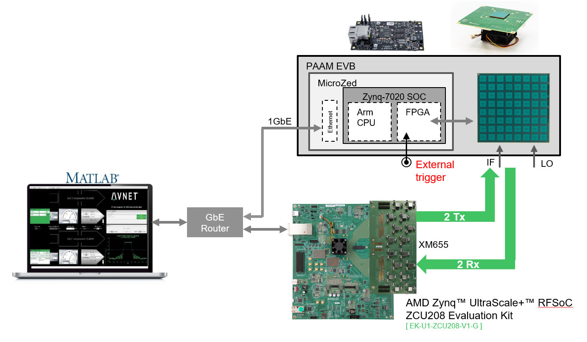
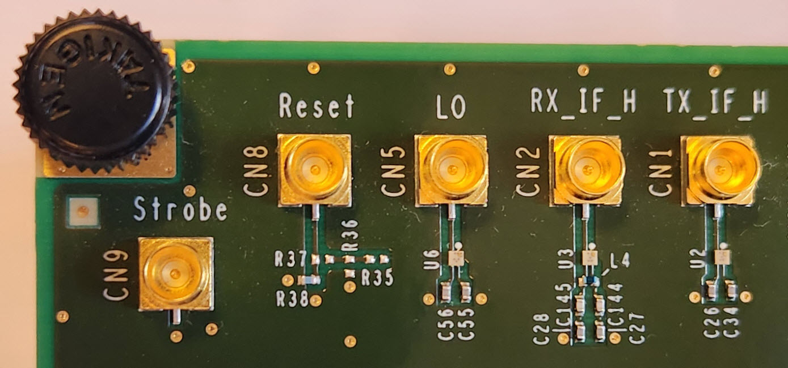
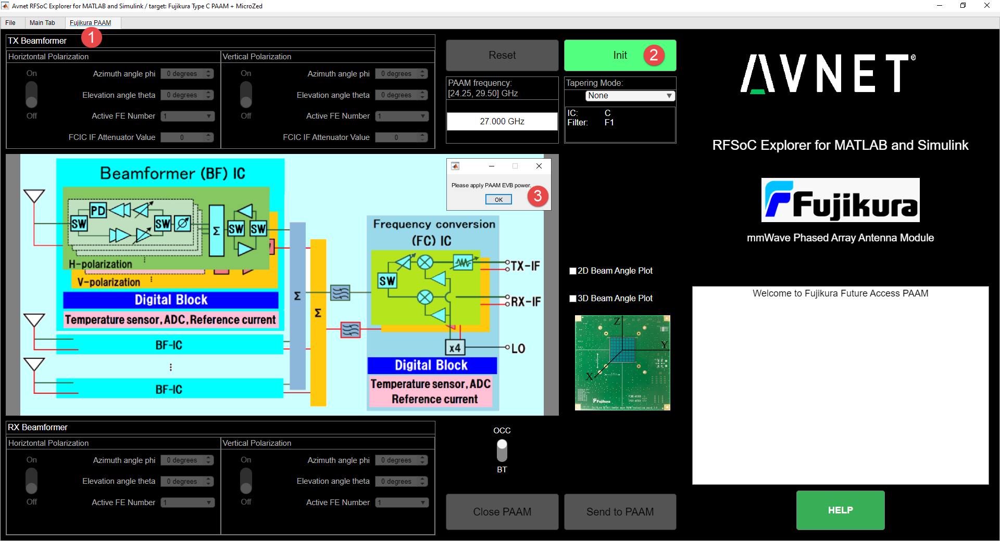
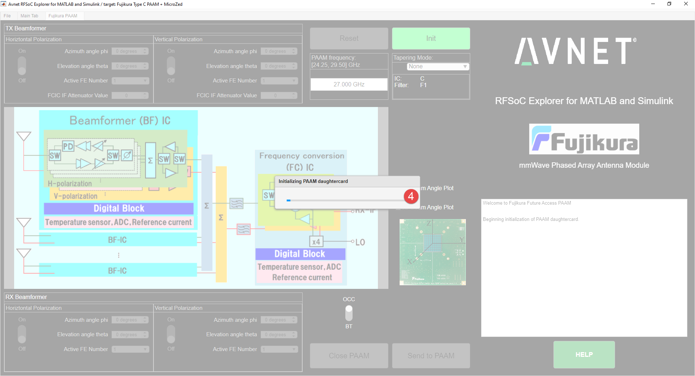
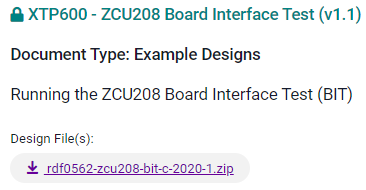
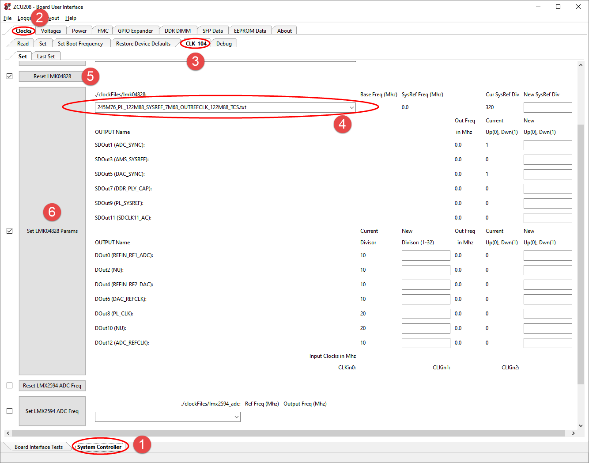

<table class="sphinxhide" width="100%">
 <tr width="100%">
    <td align="center"><h1><h1>
	5G mmWave <span style="color:red;">Type-C</span> PAAM Development Platform User Guide
    </td>
 </tr>
</table>

<br>
<span style="color:red; font-size:25px;">Note!!   This document is for the Fujikura Type-C PAAM, not for the now-superseded Task-A/B PAAM.</span><br>
If you are interested in the Fujikura Task-A/B PAAM documentation, please see the <a href="https://github.com/Avnet/Fujikura-beamforming-TaskAB" style="font-size:25px;">5G mmWave Task-A/B PAAM Development Platform User Guide</a>.<br>

__Also, please follow [this FAQ link](./FAQ.md) for some Frequently Asked Questions and their answers__</a>.<br>

# Document Control

**Document Version:** 3.0.2

**Document Date:** 11/08/2025

# Version History

| Version |     | Date         |     | Comment                                               |     |
|---------|-----|--------------|-----|-------------------------------------------------------|-----|
| 3.0.0   |     | Nov 08, 2024 |     | Initial public release with RFSoC Explorer 3.1.1      |     |
| 3.0.1   |     | Nov 14, 2024 |     | Updated screenshots for Type-C PAAM                   |     |
| 3.0.2   |     | Dec 05, 2024 |     | Added new setup sequence with PAAM first              |     |
|         |     |              |     |                                                       |     |
# Table of contents

1. [Overview](#1-overview)

    1.1 [The AMD ZCU208 RFSoC evaluation kit](#overview-zcu208-kit)

    1.2 [The Fujikura Type-C PAAM Evaluation Board (EVB)](#overview-paam-evb)

    1.3 [Beam Switching using the Fujikura Type-C PAAM](#overview-beam-switching)

    1.4 [Multiple PAAM control](#multiple-paam-control)

    1.5 [Suggested Setup Sequence](#suggested-setup-sequence)

2. [Setting up the Fujikura Type-C PAAM EVB](#setting-up-evb")

3. [Setting up the AMD ZCU208 Evaluation Board](#zcu208-board)

    3.1 [uSD Card Preparation](#usd-card-preparation)

4. [Connecting the ZCU208 to your PC](#connecting-the-zcu208-to-your-pc)

    4.1 [Serial Port Connection](#41-serial-port-connection)

    4.2 [Getting the IP Address](#42-getting-the-ip-address)

    4.3 [Setting a Static IP Address](#43-setting-a-static-ip-address)

5. [Connecting the ZCU208 to the Fujikura Type-C PAAM](#connecting-the-fujikura-paam)
    
    5.1 [Breaking out the ZCU208 RF signals using the AMD XM655](#breaking-out-xm655)

    5.1.1 [XM655 balun replacement](#xm655-balun-replacement)

    5.1.2 [Using a Carlisle CoreHC2 breakout assembly](#carlisle-core)

    5.3 [Connecting the Type-C PAAM EVB to the ZCU208](#connecting-paam-evb-and-zcu208)

    5.3.1 [Ethernet Connections](#ethernet-connections)

    5.3.2 [Analog Connections](#analog-connections)

    5.3.3 [Sync Trigger Connections](#sync-trigger-connections)

    5.4 [Connecting the Analog Path and Instruments](#connecting-the-analog-path-and-instruments)

<!-- This is a comment in Markdown and won't appear in the rendered document.
    5.5. [Using the C# Test GUI (optional)](#using-the-c-test-gui-optional)
-->
6. [Installing MATLAB and Avnet RFSoC Explorer®](#installing-matlab-and-avnet-rfsoc-explorer)

    6.1 [Setting up Python Support in Matlab](#setting-up-python-support-in-matlab)
   
    6.1.1 [Setting the Python version in MATLAB](#setting-the-python-version-in-matlab)

7. [Testing the RFSoC Explorer Digital Interface](#testing-the-rfsoc-explorer-digital-interface)

<!-- This is a comment in Markdown and won't appear in the rendered document. -->
<!--
    7.1 [ADC and DAC Control Tab ](#adc-and-dac-control-tab)
-->
<!-- This is a comment in Markdown and won't appear in the rendered document.
8. [Fixture for the Daughtercard](#fixture-for-the-daughtercard)

    8.1 [Daughtercard installation on the fixing stand](#daughtercard-installation-on-the-fixing-stand)

-->
8. [Over-the-air Testing with Rohde & Schwarz ATS800B compact antenna test range](#over-the-air-testing)

9. [Appendix 1 - Not Used: Using the CLK-104 Module](#using-the-clk-104-module)

<!-- This is a comment in Markdown and won't appear in the rendered document.
11. [Appendix 2 - Not Used: Renesas 8V97003 18 GHz RF Synthesizer](#renesas-8v97003-18-ghz-rf-synthesizer)

-->
10. [Terminology](#terminology)

# Figures

Figure 1.a – [ZCU208 5G Development Platform with XM655 and a generic Fujikura PAAM](#figure-ZCU208-with-XM655-and-generic-PAAM)

Figure 1.1.a – [ZCU208 5G Development Platform with XM655 and CLK-104 plug-in cards](#figure-ZCU208-with-XM655-clk104)

Figure 1.2.a – [Fujikura Type-C PAAM Evaluation board (EVB) with block diagram](#figure-Type-C-PAAM-EVB-and-diagram)

Figure 1.2.b – [Fujikura Type-C PAAM](#figure-Type-C-PAAM)

Figure 1.3.a – [Avnet MicroZed on the Fujikura Type-C PAAM EVB](#figure-type-c-paam-only-diagram)

Figure 1.3.b – [Fast beam switching using the Fujikura Type-C PAAM](#figure-type-c-beam-switching-no-NDA)

Figure 1.4.a – [Using 4 Fujikura Type-C PAAMs with one ZCU208](#figure-type-c-multiple-paams)

Figure 1.5.a – [Two separate development kits](#figure-setup-stages)

Figure 1.5.a – [Combined setup](#figure-setup-combined)

Figure 2.a – [Fujikura Type-C PAAM Evaluation board (EVB) with cooling fan attached to the under-side](#figure-Type-C-PAAM-EVB-3d)

Figure 2.b – [Fujikura Type-C PAAM Evaluation board (EVB) antenna side](#figure-Type-C-PAAM-EVB-and-antenna-side)

Figure 2.c – [Fujikura Type-C PAAM Evaluation board (EVB) component side (no MicroZed)](#figure–Type-C-PAAM-EVB-component-side)

Figure 2.d – [Fujikura Type-C PAAM Evaluation board (EVB) component side (with MicroZed SOM mounted)](#figure–Type-C-PAAM-EVB-component-side-with-microzed)

Figure 3.a – [AMD ZCU208 Evaluation Board](#figure-amd-zcu208-development-board)

Figure 4.1.a – [Completed boot sequence](#figure-ZCU208-booted)

Figure 5.1.a – [AMD's XM655 plug-in card](#figure-xm655)

Figure 5.1.b – [XM655 attached to the ZCU208](#figure-zcu208-with-xm655)

Figure 5.1.1.a – [XM655 frequency groupings of compression-mount SMA's](#figure-zcu208-with-xm655)

Figure 5.1.1.b – [Carlisle break-outs](#figure-Carlisle-breakouts)

Figure 5.1.2.a – [Carlisle CoreHC2 8-Channel Male Cable](#figure-Carlisle)

Figure 5.3.a – [Test setup overview](#figure–setup-overview)

Figure 5.3.2.a – [Fujikura Type-C PAAM EVB SMA connectors](#figure–EVB-SMAs)

Figure 5.3.2.b – [Typical tile assignments in RFSoC Explorer](#figure-Tiles-for-4p9Ghz)

Figure A1.a – [Board User Interface to the CLK-104 Module](#figure-board-ui-clk104)

Figure A2.a – [Renesas 8V97003 RF Synthesizer in Fractional Mode](#figure-renesas-8v97003-fract-mode)

Figure A2.b – [Renesas 8V97003 RF Synthesizer in Integer Mode](#figure-renesas-8v97003-int-mode)

# 1) Overview <a name="1-overview"></a>

Avnet's [5G mmWave PAAM Development Platform](https://www.avnet.com/wps/portal/us/products/avnet-boards/avnet-board-families/5g-mmwave-paam-development-platform/) combines the [AMD ZCU208 evaluation kit](https://www.xilinx.com/products/boards-and-kits/zcu208.html) with the Fujikura Type-C PAAM.

<a name="figure-ZCU208-with-XM655-and-generic-PAAM"></a>
<br>
__Figure 1.a – ZCU208 5G Development Platform with XM655 and a generic Fujikura PAAM__

## 1.1 The AMD ZCU208 RFSoC evaluation kit <a name="overview-zcu208-kit"></a>
AMD's ZCU208 Zynq UltraScale+ RFSoC evaluation kit features the [ZU48DR device](https://www.xilinx.com/products/silicon-devices/soc/rfsoc.html):

- **Cortex®-A53** core,

- **Cortex-R5** core and, amongst other peripherals, integrates

- eight 14-bit 5GSPS ADCs,

- and eight 14-bit 10GSPS\* DACs.

The image below shows the ZCU208 with
- A [XM655 plug-in card](https://docs.amd.com/r/en-US/ug1390-zcu216-eval-bd/XM650/XM655-Balun-Add-on-Cards-for-RFSoC-EVM) that breaks out the ADC and DAC signals to multiple SMA connectors
- A [CLK-104 add-on card](https://docs.amd.com/r/en-US/ug1437-clk104) designed for use with Zynq® UltraScale+™ RFSoC Gen3 ZCU216 and ZCU208 evaluation boards. It provides an ultra low-noise, wideband RF clock source for the analog-to-digital and digital-to-ananlog converters (ADCs and DACs).  The clock distribution PLL provides the low frequency reference clock for the integrated PLL of RFSoC devices.  __Note__ that the setup described in this user guide for the Fujikura Type-C PAAM does not require that the CLK-104 card be mounted or used.<br>
<a name="figure-ZCU208-with-XM655-clk104"></a>
<br>
__Figure 1.1.a – ZCU208 5G Development Platform with XM655 and CLK-104 plug-in cards__

## 1.2 The Fujikura Type-C PAAM Evaluation Board (EVB) <a name="overview-paam-evb"></a>
The [Fujikura Type-C PAAM Evaluation Board (EVB)](https://mmwavetech.fujikura.jp/img/5g/MW96-11-22-0046(8)_Type-C-Evb_Product%20Brief.pdf) houses the PAAM itself.

<a name="figure-Type-C-PAAM-EVB-and-diagram"></a>
<br>
__Figure 1.2.a – Fujikura Type-C PAAM Evaluation board (EVB) with block diagram__


The [Fujikura Type-C PAAM](https://mmwavetech.fujikura.jp/img/5g/MW96-11-22-0008(12)_Type-C_Brochure.pdf) features:
- A 64-element 8x8 phased array antenna
- Scalable configuration with 8x8 element PAAM as a unit
- Operates at 28 GHz (24.25-27.50 GHz or 26.50-29.50 GHz) 
- Can transmit and receive dual polarizations (both Horizontal and Vertical)
- It integrates Beamformer ICs (BFIC), Frequency conversion IC (FCIC) and Band pass filters
- Calibration free; precise beam control without gain/phase calibration
- Fast beam switching of < 220 ns
- Supports > 20,000 beams
- EIRP 48 dBm at EVM 3%
- Fast parallel interface for digital control<br>

<a name="figure-Type-C-PAAM"></a>
<br>
__Figure 1.2.b – Fujikura Type-C PAAM__<br>

## 1.3 Beam Switching using the Fujikura Type-C PAAM <a name="overview-beam-switching"></a>

On the Type-C PAAM EVB, there is an [Avnet MicroZed 7020 SOM](https://www.avnet.com/wps/portal/us/products/avnet-boards/avnet-board-families/microzed).  This module is used for fast digital control of the PAAM, as well as for diagnostics, over Ethernet.<br>
<a name="figure–type-c-paam-only-diagram"></a><br>
<br>
__Figure 1.3.a – Avnet MicroZed on the Fujikura Type-C PAAM EVB__

Via the MicroZed, the PAAM can be used for fast switching between beams.  Each time the beam position has to switch, the MicroZed has to transfer a command with data to the PAAM.
The beam switching can be done in a number of ways, with or without an external trigger signal.  Note that it is also possible to select an internally-generated trigger with a programmable period instead of an external trigger.<br>
As is shown in the diagram below, three beam-switching modes are currently supported:

- __Free-running beam switching__ : In this mode a new beam position is selected, followed by a specified delay.  This is repeated as necessary and each command is porformed after the other, sequentially.
- __Triggered beam switching__ : Here a delay period is not specified, but instead the command to change position is only sent to the PAAM once a trigger (internally or externally generated) occurs.  It typically takes only 130ns from the trigger occurrence until the new setting takes effect in the field.
- __Beam switching synchronized to an external sync trigger__ : In this mode a sequence of delay periods and beam settings is also sent, but the whole sequence will only kick off when a trigger (internally or externally generated) occurs.  This allows for a pattern/burst to be repeated but for the start of that sequence to be tied to a specific triggering event.<br>

<a name="figure-6-type-c-beam-switching-no-NDA"></a>

__Figure 1.3.b – Fast beam switching using the Fujikura Type-C PAAM__


Note: For detail on the mechanism outlined above, as well as for PAAM datasheets and characterization information, an NDA is required.  To request such an NDA, please submit the your contact information [using the form-fill on this page](https://www.avnet.com/wps/portal/us/products/avnet-boards/avnet-board-families/5g-mmwave-paam-development-platform/5g-mmwave-paam-platform-family) or just send a request by email to rfinfo@avnet.com .

## 1.4 Multiple PAAM control <a name="multiple-paam-control"></a>

__Note: Version 3.2. of RFSoC Explorer does not support Multiple PAAMs yet, but that functionality is under way and will be coming soon.__
Each Type-C PAAM allows for a Horizontal (H) and a Vertical (V) channel for both transmit (Tx) and receive (Rx).  So we have TX_H, TX_V, RX_H and RX_V.
The ZCU208 provides 8 RFSoC DAC channels and 8 RFSoc ADC channels.
Since each PAAM has 2 Tx and 2 Rx connections, we can connect 4 PAAM EVBs to one ZCU208 EVB.  Keep in mind that each signal is assumed to be single-ended.  So the differential signals will have to be converted to single-ended, using baluns.  This is discussed in [Breaking out the ZCU208 RF signals using the AMD XM655](#"breaking-out-xm655").

The ZCU208 and each MicroZed will be assigned a separate IP address.  The diagram below shows the configuration.  In this case an external trigger signal is generated by the ZCU208.<br>
<a name="figure-type-c-multiple-paams"></a><br>
<br>
__Figure 1.4.a – Using 4 Fujikura Type-C PAAMs with one ZCU208__

## 1.5 Suggested Setup Sequence <a name="suggested-setup-sequence"></a>

In this user guide the user is guided through the steps of hardware and software setup so that he/she can start using the Fujikura Type-C PAAM with TRIA's __RFSoC Explorer__ tool.

The image below shows two separate development kits.

(1) is the Fujikura Type-C EVB (Evaluation Board).  Detailed instructions for setting it up can be obtained from Fujikura after signing an NDA.  They also provide a set of Python scripts that demonstrate the various PAAM capabilities.  In this setup, the IF signals will be provided via a signal generator and received signals will be displayed on test equipment.<br>

(2) is an RFSoC development setup that consists of the the [AMD ZCU208 evaluation kit](https://www.xilinx.com/products/boards-and-kits/zcu208.html) combined with TRIA's [__RFSoC Explorer__](https://www.mathworks.com/rfsoc) tool wherein MATLAB® functions can be used to generate waveforms and to display the received signals.<br>

(3) is a set of cabled interconnections so that connects 
- the ZCU208's RFSoC DAC outputs to the IF inputs of the Type-C PAAM EVB 
- the IF outputs of the Type-C PAAM EVB to the ZCU208's RFSoC ADC inputs

__Note__ that using the Fujikura Python scripts for PAAM evaluation as in (1) above could be useful for experimentation, but that it is not necessary in order to complete the instructions in this guide.  __RFSoC Explorer__ leverages those Python functions directly.

<a name="figure-setup-stages"></a><br>
<br>
__Figure 1.5.a – Two separate development kits__

Once combined, the setup is as below.  

<a name="figure-setup-combined"></a><br>
<br>
__Figure 1.5.b – Combined setup__

# 2) Setting up the Fujikura Type-C PAAM EVB <a name="setting-up-evb"></a>

If you have signed the required Non-disclorure Agreement (NDA), Fujikura will provide you with access to a download location for the documentation, datasheets and user guide for the Fujikura Type C PAAM Evaluation board (EVB).  
If you have not signed the NDA yet but are interested in more detail on Fujikura PAAMs, please submit the your contact information [using the form-fill on this page](https://www.avnet.com/wps/portal/us/products/avnet-boards/avnet-board-families/5g-mmwave-paam-development-platform/5g-mmwave-paam-platform-family) or just send a request by email to rfinfo@avnet.com .

Once you have access to the Fujikura documentation, please follow the steps outlined in their user manual, __"User manual of the evaluation board: 28 GHz Phased Array Antenna Module"__.
This document will guide you through the steps for:
- Providing the EVB with power
- Connecting digital control to a host computer
- Connecting a Local Oscillator (LO)
- Connecting Signal Generator and Signal Analyzer to operate in either transmit or receive mode
- Running various Python scrips on the host to exercise these modes and to demonstrate the various PAAM features

__Note__ that using the Fujikura Python scripts for PAAM evaluation could be useful for experimentation, but that it is not necessary in order to complete the instructions in this guide.<br>
__RFSoC Explorer__ will be used to control the PAAM

The images below show various views of the Fujikura Type-C PAAM EVB.

<a name="figure-Type-C-PAAM-EVB-3d"></a>
<br>
__Figure 2.a – Fujikura Type-C PAAM Evaluation board (EVB) with cooling fan attached to the under-side__<br>

<a name="figure-Type-C-PAAM-EVB-and-antenna-side"></a>
<br>
__Figure 2.b – Fujikura Type-C PAAM Evaluation board (EVB) antenna side__<br>

<a name="figure–Type-C-PAAM-EVB-component-side"></a>
<br>
__Figure 2.c – Fujikura Type-C PAAM Evaluation board (EVB) component side (no MicroZed)__<br>

<a name="figure–Type-C-PAAM-EVB-component-side-with-microzed"></a>
<br>
__Figure 2.d – Fujikura Type-C PAAM Evaluation board (EVB) component side (with MicroZed SOM mounted)__<br>

# 3) Setting up the AMD ZCU208 Evaluation Board <a name="zcu208-board"></a>

For instructions on setting up the ZCU208, please refer to the [ZCU208 User Guide](https://docs.xilinx.com/v/u/en-US/ug1410-zcu208-eval-bd) and
the guide for [ZCU208 Software Install and Board Setup](https://www.xilinx.com/support/documents/boards_and_kits/zcu208/2020_1/xtp607-zcu208-setup-c-2020-1.pdf).

Note that for the purposes of this user guide, some sections in the documents mentioned above can be skipped:
- Skip the installation of AMD tools such as Vitis, Vivado, SDK, HL, etc.
- Attach the XM655 (not the XM650 as described in the guide)
- Set S2 for booting from Micro SD card
- If the ZCU208 is connected to a DHCP router, skip the Ethernet setup
- Skip the Optional Hardware configuration steps

Some relevant components for the instructions below are marked in this diagram.<br>

<a name="figure-amd-zcu208-development-board"></a>
<br>
__Figure 3.a – AMD ZCU208 Evaluation Board__

<span class="mark">(1)</span> Marks the uSD card slot J23

<span class="mark">(2)</span> Marks the micro USB Type B serial cable connector J24 that goes to the PC

<span class="mark">(3)</span> Marks the Ethernet cable connector P1

<span class="mark">(4)</span> Marks the power connector J50 and

<span class="mark">(5)</span> marks the power ON/OFF switch SW15

<span class="mark">(6)</span> marks the [XM655 plug-in card](https://docs.amd.com/r/en-US/ug1390-zcu216-eval-bd/XM650/XM655-Balun-Add-on-Cards-for-RFSoC-EVM) that allows access to the ZCU208 RFSoC's ADC and DAC signals

## 3.1 uSD Card Preparation <a name="usd-card-preparation"></a>

A Micro SD (uSD) card ships with the ZCU208. A different uSD card can be
used, but it is important to know that some uSD cards do not work well
with AMD development boards. Please consult [this
link](https://support.xilinx.com/s/article/66779) for list of SD cards
that have been tested with Zynq UltraScale+ MPSoC.

Follow these steps to load a custom SD card boot image for the ZCU208,
allowing it to control the Fujikura PAAM Daughtercard via RFSoC
Explorer.

1.  Remove the SD card from slot J23 on the ZCU208 and insert into your
    PC. Then format it as FAT using a tool like [SD Memory Card Formatter](https://www.sdcard.org/downloads/formatter_4/).

2.  Download the boot image archive zip file from the public repository
    at [ZCU208 uSD Card](https://github.com/Avnet/Fujikura-beamforming/releases/tag/3.1.1).

3.  Unzip the archive to the root level of the SD card.  
    

4.  Safely eject the SD card from the PC and replace it in the J23 slot
    on the ZCU208.

# 4) Connecting the ZCU208 to your PC <a name="connecting-the-zcu208-to-your-pc"></a>

## 4.1 Serial Port Connection <a name="41-serial-port-connection"></a>

Connect a micro USB Type B to USB Type A serial comms cable between J24
on the ZCU208 and a USB port on your PC.

If your PC does not automatically detect the new COM ports associated
with the ZCU208, you should consult the guide for [ZCU208 Software
Install and Board
Setup](https://www.xilinx.com/support/documents/boards_and_kits/zcu208/2020_1/xtp607-zcu208-setup-c-2020-1.pdf).

In summary:

1.  If your PC does not automatically detect and enumerate new COM ports for the ZCU208, you may need to install [FTDI Virtual COM Port (VCP) drivers](https://ftdichip.com/drivers/vcp-drivers/).

2.  Three new COM ports for the ZCU208 should appear in the Windows
    Device Manager. Each of these COM ports should show that it is using
    the FTDI driver:  
    

3.  These 3 COM ports are usually in numerical order and it is important
    that of these 3 ports, you select the COM port with the lowest value
    when connecting to the serial port for the Zynq device on the
    ZCU208. Here that port is COM8, but on your PC it could be 3 other
    numbers that show up, and you should pick the lowest one.  
      
    

4.  Open a serial terminal emulator (e.g. TeraTerm) on your PC.  
    Make sure you **select 115200 as the Baud rate** and that you picked
    the correct COM port.  
      
    

5.  Connect the ZCU208 power supply to an outlet and to connector J50.
    Then power ON the board using SW15.

6.  The serial terminal emulator should start showing the boot log as
    below.  
    

7.  When the boot process completes, this should be the output. Note
    that the displayed IP address will not necessarily be one that can
    be used. **We will discuss setting the IP address in the next section**.  
      
    <a name="figure-ZCU208-booted"></a>
    

<span id="_Ref141963341" class="anchor"></span>
__Figure 4.1.a – Completed boot sequence__

## 4.2 Getting the IP Address <a name="42-getting-the-ip-address"></a>

1.  Connect an Ethernet cable from P1 on the ZCU208 to the local network
    that your PC is on.

2.  On the serial port terminal that is shown in [Completed boot sequence](#figure-ZCU208-booted), hit Enter so that a login prompt will be shown. Enter **root** for the login name
    and then again **root** for the password.

3. Enter **ifconfig**. Note the IP address, since you will use this address to connect to the board from your PC.<br>
   

4. From a Command Prompt on your PC, verify that you can connect to the ZCU208 by pinging the IP address above.<br>
   

## 4.3 Setting a Static IP Address <a name="43-setting-a-static-ip-address"></a>

The image below outlines the setup that we want to achieve.<br>
<a name="figure-setup-overview"></a>
<br>
__Test setup overview__

1.  If you intend to connect the ZCU208 to an Ethernet port on your PC
    directly, you may have to edit the **autostart.sh** file on the
    ZCU208’s uSD card first.

2.  Power the ZCU208 off using SW15 and remove the uSD card from its
    slot, J23.

3.  Insert the uSD card into your PC and open **autostart.sh** in a text
    editor.  
    Note: **Make sure you are using a Linux-compatible editor like
    Notepad++ so that lines are terminated with a LF character only**.

4.  Set **USE_DHCP=false**  
    

5.  Safely eject the SD card from the PC and replace it in the J23 slot
    on the ZCU208 and turn the ZCU208 power switch SW15 ON

6.  The application auto-start function creates an IP connection for the
    board at an address like 169.254.10.2. To use a different IP
    address, simply modify the IPADDR field in the autostart.sh file.  
    

7.  Set a static IP for your host PC’s Local Ethernet adapter. Make sure
    your PC and the board are on the same subnet and gateway. See the
    example below.


# 5) Connecting the ZCU208 to the Fujikura Type-C PAAM <a name="connecting-the-fujikura-paam"></a>

## 5.1 Breaking out the ZCU208 RF signals using the AMD XM655<a name="breaking-out-xm655"></a>
The [XM655 plug-in card](https://docs.amd.com/r/en-US/ug1390-zcu216-eval-bd/XM650/XM655-Balun-Add-on-Cards-for-RFSoC-EVM) allows access to the ZCU208 RFSoC's ADC and DAC signals.
It also allows for 20 DACIO and 20 ADCIO digital I/O pins on a header strip.  Note that __for the ZCU208 only 16 DACIO and 16 ADCIO signals__ are connected to the Zynq device.
See Appendix C of the [ZCU208 Evaluation Board User Guide](https://docs.amd.com/v/u/en-US/ug1410-zcu208-eval-bd) for details.
<a name="figure-xm655"></a>
<br>
__Figure 5.1.a – AMD's XM655 plug-in card__

The XM655 can be attached to the ZCU208 by plugging it into the two RFMC connectors, J87 and J82, and then securing it with 4 through-hole screws.

<a name="figure-zcu208-with-xm655"></a>
<br>
__Figure 5.1.b – XM655 attached to the ZCU208__

The XM655 enables access to RF-ADC and RF-DAC signals differentially or single-ended. For convenience, this tutorial uses single-ended connections. As you will see, this limits the number of IF signals available.  An alternative methodology, using differential connection to the XM655, is also described to enable connection to all RF-ADC and RF-DAC channels, but requires additional external equipment.

### 5.1.1 Single-ended IF connection to XM655 baluns<a name="xm655-balun-replacement"></a>
The XM655 includes baluns to convert differential RF signals from the ZCU208 to single-ended by way of various SMA connections. Different baluns on the XM655 have different band pass filter responses. Only a subset of baluns have a filter response suitable to pass 4.9GHz IF signals to/from the Fujikura PAAM evaluation board. The available baluns allow for [2 channel connections in each of these 4 bands](https://xilinx-wiki.atlassian.net/wiki/spaces/A/pages/769228974/XM650+XM655+and+CLK104+Add-On+Cards+Hardware+Description#:~:text=Guide%20(UG1410).-,XM655%20Breakout%20Add%2DOn%20Card,-The%20XM655%20add):
- Low:&nbsp;&nbsp;&nbsp;&nbsp;&nbsp;&nbsp;&nbsp;&nbsp;&nbsp;10MHz - 1GHz uses Minicircuits TCM2-33WX+ balun
- Mid-Low:&nbsp;&nbsp;1GHz - 4GHz uses Anaren BD1631J50100AHF balun
- Mid-High:&nbsp;__4GHz - 5GHz__ uses Anaren BD3150N50100AHF balun
- High:&nbsp;&nbsp;&nbsp;&nbsp;&nbsp;&nbsp;&nbsp;&nbsp;__5GHz - 6GHz__ uses Anaren BD4859N50100AHF balun

Each of these balun types is associated with specific group of compression mount SMAs on the board, as indicated by the silkscreen boxes.  The diagram below also illustrates the groupings of the SMA connectors (red dots).
<a name="figure-zcu208-with-xm655"></a>
<br>
__Figure 5.1.1.a – XM655 frequency groupings of compression-mount SMA's__

As the Fujikura Type C PAAM operates at 4.9GHz IF (4.3 to 5.5GHz), the XM655 standard baluns will only allow for the use of the 2 Mid-High connectors and possibly the 2 High connectors.

The image below shows a two RF-DAC and two RF-ADC connections to XM655 4-5MHz baluns using the Carlisle ganged cables that are included in the ZCU208 kit.<br>
<a name="figure-Carlisle-breakouts"></a>
<br>
__Figure 5.1.1.b – Carlisle break-outs__

<!-- This is a comment in Markdown and won't appear in the rendered document.
It is possible to re-work the XM655 at your own risk by replacing the default baluns and you will have to verify that there is pin-for-pin compatibility for swapping in the different replacements. This may be the cheapest option. 
-->
### 5.1.2 Differential IF connection with XM655 Carlisle cables<a name="carlisle-core"></a>

The number of 4-5 GHz baluns on the XM655 limits single-ended connections to support only a single Fujikura PAAM (1TX h/v and 1RX h/v). However, an alternative methodology is available using differential connections to the XM655. In this configuration the RF-ADC and RF-DAC differential signals can be connected from the Carlisle ganged connector to external equipment to convert to single-ended within the IF range of the Fujikura PAAM.

This approach will bypass the baluns on the XM655 board by bringing out the RF signals via the Carlisle CoreHC2 breakout assembly to external baluns. Two sets of these cable assemblies ship with each ZCU208 kit.  See Page 80 of the [ZCU208 Evaluation Board User Guide](https://docs.amd.com/v/u/en-US/ug1410-zcu208-eval-bd)
If you need more break-outs than what the two included sets provide, the __Carlisle Core HC2 8 Channel – Male, 3.5 mm TM40-0157-00__ can be ordered from: https://www.digikey.com/en/products/detail/carlisleit/TM40-0157-00/11502992
<a name="figure-Carlisle"></a>
<br>
__Figure 5.1.2.a – Carlisle CoreHC2 8-Channel Male Cable__

## 5.3 Connecting the Type-C PAAM EVB to the ZCU208 <a name="connecting-paam-evb-and-zcu208"></a>

Once you are familiar with setting up and using the Type-C PAAM EVB, you should be ready to continue on towards using it with the ZCU208.  This will allow you to use [AMD's RFSoC technology](https://www.amd.com/en/products/adaptive-socs-and-fpgas/soc/zynq-ultrascale-plus-rfsoc.html) to drive the PAAM inputs and to process its outputs.  This setup will also allow you to use the Avnet RFSoC Explorer tool and MATLAB functions.<br>
The image below outlines the setup that we want to achieve.<br>
<a name="figure-setup-overview"></a>
<br>
__Figure 5.3.a – Test setup overview__

### 5.3.1 Ethernet Connections<a name="ethernet-connections"></a>
From the host PC, digital control for the ZCU208 and the Fujikura PAAM is done via Ethernet.  An Ethernet router is required so that the connected devices will be on the same sub-net.
As per the [diagram above](#figure–setup-overview), connect the following to an Ethernet router:
- your PC
- the ZCU208 - see connector (3) in [Figure 7](#figure-7-amd-zcu208-development-board)
- the Fujikura Type-C PAAM EVB, using J1 on the MicroZed SOM

### 5.3.2 Analog Connections<a name="analog-connections"></a>
The two images below show the compression-mount SMA connectors on the under-side (fan side) of the Type-C PAAM EVB.<br>
<a name="figure-EVB-SMAs"></a>


<br>

__Figure 5.3.2.a – Fujikura Type-C PAAM EVB SMA connectors__

Use SMA cables and follow the instructions below:

1.  Make sure to power off the ZCU208 first, using the ON/OFF switch, SW15.

2.  Make sure that the PAAM power is turned off at the 12V and 5V power supply/supplies.

3.  Connect the SMA cables as follows:  

- __Tx_IF_H - CN1 on the PAAM EVB__ to __J9 on the XM655__<br>
- __Tx_IF_V - CN3 on the PAAM EVB__ to __J27 on the XM655__<br>
- __Rx_IF_H - CN2 on the PAAM EVB__ to __J4 on the XM655__<br>
- __Rx_IF_V - CN4 on the PAAM EVB__ to __J34 on the XM655__<br>

The reasoning for the connections above is as follows:
The Fujikura Type C PAAM operates at 4.9GHz IF (4.3 to 5.5GHz).  So one could use the [Carlisle CoreHC2 breakout assembly](#carlisle-core) with external baluns, or one could [pick some baluns on the XM655 board itself](#xm655-balun-replacement).  Since the range for this PAAM is 4.3 to 5.5GHz, we could pick baluns in the 4-5 GHz range or in the 5-6 GHz range, depending on the application's exact frequency.<br>

DAC Tile 229 Chan 0 p/n wired to XM655 balun 4-5 GHz (J10, J12), which has an output on J9.<br>
<a name="XM655_DAC_balun_example"></a>
<br>
ADC Tile 224 Chan 0 p/n wired to XM655 balun 4-5 GHz (J2, J6), which has an input on J4.<br>

See the image below for the typical tile assignments in RFSoC Explorer.  This is just for information, as the RFSoC Explorer tool, in which tile assignments are done, is only described [later](#installing-matlab-and-avnet-rfsoc-explorer).<br>
<a name="figure-Tiles-for-4p9Ghz"></a>
<br>
__Figure 5.3.2.b – Typical tile assignments in RFSoC Explorer__

4.  First turn on the ZCU208 power supply. Then turn on the Daughtercard power supply with its ON/OFF switch SW1. The fan should make a loud noise, indicating that it works.

__NOTE__
\* Do not touch the PAAM surface. If the antenna is scratched, the expected performance may not be achieved.

\*\* Do not remove the heatsink. If the heatsink is removed even once, the heat dissipation performance cannot be guaranteed.

\*\*\*Incorrect connection will short the power supply.

### 5.3.3 Sync Trigger Connections<a name="sync-trigger-connections"></a>
TBD

##  5.4 Connecting the Analog Path and Instruments <a name="connecting-the-analog-path-and-instruments"></a>

TBD

<!-- This is a comment in Markdown and won't appear in the rendered document.
##  5.5 Using the C# Test GUI (optional) <a name="using-the-c-test-gui-optional"></a>

Avnet created a custom test utility that can be used to verify that the
peripherals on the Fujikura PAAM Daughtercard work correctly. These
peripherals are:  

- The power supply regulators

- An EEPROM for storing board parameters and version information

- Five attenuators (4 for the Tx and Rx H and V paths and one for the
  PLL output)

- A 4-channel DAC for setting trim values for the power supply rails

- Four 8-channel ADC’s

- A Renesas 8V97003 PLL for creating the LO if an external input is not
  provided

A Linux utility, **fjk_tcp**, runs on the ZCU208 and processes
communications from a host in the form of JSON strings via Ethernet port
8083. It is important to note that **only one host utility**, i.e.
either RFSoC Explorer or the C# GUI, **can use that port**. So only one
of the two can be used at a time.

A link for downloading the C# test utility can be requested from Avnet.
It consists of a single Windows executable and two Newtonsoft files for
JSON support. They can be stored anywhere on your PC.


The utility can be run by double-clicking **Fujikura TCP Host.exe**.
When the program closes, a **Fujikura TCP Host.ini** file that stores
some of the user’s selections is saved in the same directory.

Make sure that the ZCU208 is booted, as shown in [Completed boot sequence](#figure-ZCU208-booted).

The first time you run the C# GUI, you will have to enter the ZCU208 IP
address, before clicking **Open TCP Port**.


On the “Power and Attenuation” tab that opens, click **Get Versions**
and make sure you receive a response.


All communication with the ZCU208 is via JSON strings. Note that you can
see a history of commands and responses on the **Comms** tab. You can
clear the history by clicking on **Clear Text Boxes**.


Un-checked boxes mean that the status is unknown. If you close the GUI
and re-start it, you can request the ZCU208 status by clicking the
**Read Status** button. If a value was previously set, it should show in
the GUI.
-->

# 6) Installing MATLAB and Avnet RFSoC Explorer® <a name="installing-matlab-and-avnet-rfsoc-explorer"></a>

Avnet RFSoC Explorer provides native connection to MATLAB® and Simulink®, featuring graphical control of the platform and intuitive APIs for
programmatic access.<br>


Your computer will need the following MathWorks software.

- MATLAB ([supported
  versions](https://www.mathworks.com/matlabcentral/fileexchange/73665-avnet-rfsoc-explorer))

- DSP System Toolbox

- Fixed-Point Designer

- Communications Toolbox

- Signal Processing Toolbox

- Install one of the following support packages from the MATLAB Add-On
  Manager

<!-- -->

- Communications Toolbox Support Package for Xilinx Zynq-Based Radio

- HDL Coder Support Package for Xilinx RFSoC Devices

- SoC Blockset Support Package for Xilinx Devices

Optional toolboxes for working with standards-compliant waveforms in
RFSoC Explorer

- LTE Toolbox (optional)

- 5G Toolbox (optional)

[Get a Free MATLAB Trial Package for
RFSoC](https://www.mathworks.com/rfsoc)

RFSoC Explorer installs easily using the MATLAB Add-Ons store.

1.  From **MATLAB \> Add-Ons**, search for **Avnet RFSoC Explorer** and
    click install

2.  From **MATLAB \> Add-Ons**, search for **Communications Toolbox
    Support Package for Xilinx Zynq-Based Radio** and click install

3.  If prompted, click **Setup Later**


## 6.1 Setting up Python Support in Matlab <a name="setting-up-python-support-in-matlab"></a>

RFSoC Explorer has been tested with [Python
3.9.13](https://www.python.org/downloads/release/python-3913/), but
earlier/later releases may also work.

After installing Python, the following commands are needed to install
the support libraries that are being used:

> py -m pip install --user --upgrade pip
>
> py -m pip install pyserial
>
> py -m pip install numpy
>
> py -m pip install spectrum
>
> py -m pip install pandas
>
> py -m pip install openpyxl
>
> py -m pip install pyvisa

###  6.1.1 Setting the Python version in MATLAB <a name="setting-the-python-version-in-matlab"></a>

1.  First, check whether the correct Python version is supported in your
    MATLAB installation by entering:
```
>> pyenv

ans =
    PythonEnvironment with properties:
       Version: "3.9"
    Executable: "C:\Users\Name\AppData\Local\Programs\Python\Python39\python.exe"
       Library: "C:\Users\Name\AppData\Local\Programs\Python\Python39\python39.dll"
          Home: "C:\Users\Name\AppData\Local\Programs\Python\Python39"
        Status: NotLoaded
 ExecutionMode: InProcess
```
The response above is for a valid Python environment; the important
property is 'Executable'.

2.  **If these are not as expected**, enter:
```
>> [~, exepath\] = system("where python")

    exepath =
    C:\Users\Name\AppData\Local\Programs\Python\Python39\python.exe
    C:\Users\Name\AppData\Local\Microsoft\WindowsApps\python.exe
```

The valid path to the version 3.9 executable is in 'Python39' folder.

3.  Now enter (using the valid path above):
```
>> pyenv('Version', 'C:\Users\Name\AppData\Local\Programs\Python\Python39\python.exe')

ans =
    PythonEnvironment with properties:
       Version: "3.9"
    Executable: "C:\Users\Name\AppData\Local\Programs\Python\Python39\python.exe"
       Library: "C:\Users\Name\AppData\Local\Programs\Python\Python39\python39.dll"
          Home: "C:\Users\Name\AppData\Local\Programs\Python\Python39"
        Status: NotLoaded
 ExecutionMode: InProcess
```

# 7) Testing the RFSoC Explorer Digital Interface <a name="testing-the-rfsoc-explorer-digital-interface"></a>

In MATLAB, enter:
```
>> Avnet_RFSoC_Explorer('startup', 'board_id', 9)
```

This should bring up the RFSoC Explorer GUI, starting with the Main Tab. There are two IP addresses that have to be entered, one for the ZCU208 and the other for the MicroZed.  
- The ZCU208's IP address should be displayed as in the [Completed boot sequence](#figure-ZCU208-booted) figure.<br>
- The MicroZed's IP address is specified in the "uz_network_settings.txt" file on its Micro SD card.<br>

It may be necessary to modify your default IP address if you need a different network sub-net, for instance.  If, for example, your ZCU208 is on an IP address 192.168.__0__.102, you could use a text editor to modify the MicroZed IP address from the default of 192.168.__1__.10 to 192.168.__0__.10.<br>
<br>

If you have not connected to a ZCU208 or PAAM EVB before, the IP addresses should be red and “DISCONNECTED", as below.

<br>


__Note__ that you can connect independently to the PAAM without connection to the ZCU208 if desired.  All the functions on the "Fujikura PAAM" tab are independent of the RFSoC functions on the ZCU208.<br>

If you have entered an IP address before, the utility will try to connect automatically. If connection was successful, the IP address will
be black,  
<br>

and it will be available in the drop-down for future sessions.

<br>

Once connected:

1.  Go to the **Fujikura PAAM** tab.

2.  Click **<span class="mark">Init</span>** .

3.  RFSoC Explorer should now start using Python scripts to initialize the PAAM. If it cannot communicate with the PAAM, you will get a dialog to apply PAAM EVB power. Make sure that, in addition to the MicroZed's 5V power, the 12V power supply to the PAAM EVB and its fan is also ON so that you can hear the fan and that the row of green LEDs on the antenna-side of the EVB are also on.<BR>
    Then click **OK** to continue.<BR>
    __Note__ that if the MicroZed's USB serial port is connected to a PC, it can be powered and therefore responding.  But if the PAAM's 12V is not also powered, you will get a __Python Error: timeout: timed out__ message in the text box.

<br>

4.  RFSoC Explorer should now continue initializing the PAAM. This can
    take 40 seconds to complete.

<br>

5.  When initialization is complete, the dialog box will display the steps taken, followed by **Beamformer settings sent to PAAM.** and the printout from committing those settings to the PAAM.

<br>

6.  You can now make changes to some PAAM controls. In the image below __Tx Vertical Polarization__ is turned __On__ and the __FCIC IF Attenuator Value__ is changed to 5. Note that the **<span class="mark">Send to
    PAAM</span>** button has turned green. These changes on the GUI will only take effect on the hardware once **Send to PAAM** is clicked.

<br>

7.  Send to PAAM will turn grey again and updated PAAM settings will be displayed in the dialog box.  The image of the PAAM will also be updated to show the active elements on the array.

<br>

8. If you wish to see the 2D elevation and azimuth plots or a 3D plot which approximate the beampattern of an array of 5G antenna elements, check the boxes next to the 2D/3D Beam Angle Plot text before sending the settings to the PAAM. 
   
    > NOTE: Both the [MATLAB Phased Array Toolbox](https://www.mathworks.com/products/phased-array.html) and the [MATLAB Antenna Toolbox](https://www.mathworks.com/products/antenna.html?s_tid=srchtitle_site_search_2_antenna%2520toolbox) must be installed to create plots.

<br>

<!-- This is a comment in Markdown and won't appear in the rendered document.
# 8) Fixture for the Daughtercard <a name="fixture-for-the-daughtercard"></a>

## 8.1 Daughtercard installation on the fixing stand <a name="daughtercard-installation-on-the-fixing-stand"></a>

The Fujikura PAAM Daughtercard can be used with the fixing stand to
measure RF characteristics if necessary. **Securely fix the fixing stand
to your measurement system before connecting some coaxial cables and
power cable. If the installation work is carried out while the fixing
stand is not sufficiently fixed, the evaluation board may tip over and
damage the operator or your property.**


1.  Attach the 4 hexagonal posts to the fixing base using screws with a
    tightening torque of **0.315 N·m** (red circle).\*

2.  Attach the Daughtercard to the hexagonal post attached to the fixing
    stand using screws with cap.


NOTE

\*If the fixing stand screws shown in picture are loose (blue circle,
yellow circle), retighten them with a tightening torque of **0.315 N·m
for blue circle or 0.75 N·m for yellow circle**.

CAUTION

The radio waves emitted from the PAAM may have a negative effect on the human body, so do not stand within a 1 m radius in front of the PAAM while radio waves are being emitted.
-->
# 8) Over-the-air Testing with Rohde & Schwarz ATS800B compact antenna test range (CATR) <a name="over-the-air-testing"></a>

Over-the-air testing was conducted with [Rohde & Schwarz ATS800B compact antenna test range (CATR)](https://www.rohde-schwarz.com/ca/products/test-and-measurement/antenna-test-systems-and-ota-chambers/rs-ats800b-catr-benchtop-antenna-test-system_63493-642314.html)

# TX EVM Measurement


# Opposite EVM Measurement(2 kits)


Measurements in the lab can be automated through MATLAB scripts for control of:
- parameters of AMD Zynq™RFSoC direct-RF data converters including sampling rate, complex mixer, decimation/interpolation filters, on-chip PLL for each tile (ref: [RFSoC RF Data Converter Product Guide](https://docs.xilinx.com/r/en-US/pg269-rf-data-converter))
- digital waveform streaming through direct-RF DACs, with seamless waveform generation through from [5G ToolBox from MathWorks](https://nl.mathworks.com/products/5g.html)
- Fujikura PAAM Daughtercard parameters including DSA, BFIC phase & gain control / beam weights and [Renesas 8V97003 18 GHz RF Synthesizer](#renesas-8v97003-18-ghz-rf-synthesizer) for LO
- automated measurements such as frequency, power sweeps with Rohde & Schwarz instruments [FSW43 Signal and spectrum analyzer](https://www.rohde-schwarz.com/us/products/test-and-measurement/benchtop-analyzers/rs-fsw-signal-and-spectrum-analyzer_63493-11793.html), [SMW200A vector signal generator](https://www.rohde-schwarz.com/uk/products/test-and-measurement/vector-signal-generators/rs-smw200a-vector-signal-generator_63493-38656.html) and [ZNA vector network analyzer](https://www.rohde-schwarz.com/ca/products/test-and-measurement/network-analyzers/rs-zna-vector-network-analyzers_63493-551810.html)


Learn more:
- [Optimizing EVM Measurements in 5G FR2 Phased Array Antenna Modules](https://event.on24.com/eventRegistration/EventLobbyServlet?target=reg20.jsp&eventid=4081674&sessionid=1&key=8F7DD91FEDF473E6FFEBE19EAF860D84&groupId=4455870&sourcepage=register)
- [IMS2023 San Diego with Fabrício Dourado, application engineer at Rohde & Schwarz](https://www.avnet.com/wps/portal/us/products/avnet-boards/avnet-board-families/5g-mmwave-paam-development-platform/)
- [Prototype 5G FR2 with the AMD Zynq™ RFSoC DFE and mmWave Phased Array](https://www.microwavejournal.com/events/2250-prototype-5g-fr2-with-the-amd-zynq-rfsoc-dfe-and-mmwave-phased-array)

# 9) Appendix 1 - Not Used: Using the CLK-104 Module <a name="using-the-clk-104-module"></a>
The ZCU208 kit includes a CLK-104 module that plugs into J101. There are
a few clock sources on this module and the LMK04828 output is available
as OUTPUT_REF on the J10 SMA connector. This can be connected to the PLL
input REF_EXT, which is CN12 on the Fujikura Daughtercard.

The LMK04828 is managed by a TI MPS430 System Controller. The user
interface to the System Controller is via one of the USB serial ports
(one of those ports is used for the Linux terminal).

The software used for this interface is the **ZCU208 Board User
Interface**. The installer  
**rdf0562-zcu208-bit-c-2020-1.zip** can be downloaded from  
<https://www.xilinx.com/products/boards-and-kits/zcu208.html#documentation>
.



After unzipping the file, run .\zcu208_bit\\ BoardUI\\**BoardUI.exe**.

Under File/Select the system controller port, select a port. Typically,
this enumerates as the highest number of the 3 ZCU208 USB COM ports.

The way to make sure that communications with the CLK-104 module works
is to click **Check-CLK-104**.


We want to program the LMK04828 to output 122.88MHz. This is done as
follows:

- In the release directory there is a file  
  ZCU208 CLK-104
  Card\\**245M76_PL_122M88_SYSREF_7M68_OUTREFCLK_122M88_TCS.txt**

Place this file in the folder  
.\zcu208_bit\BoardUI\tests\ZCU208\\**clockFiles\lmk04828**\\

- As in the diagram below, select the LMK04828 file to program.

- The clock can be reset (turned off) by clicking **Reset LMK04828**.

- The clock can be programmed by clicking **Set LMK04828 Params**. While
  being programmed, the D10 LED on the CLK-104 card will go off, briefly
  flash a few times and then stay on.

<a name="Board-UI-clk-104"></a>
<br>

<span id="_Toc146045117" class="anchor"></span><a name="figure-board-ui-clk104"></a>__Figure A1.a – Board User Interface to the CLK-104 Module__

<!-- This is a comment in Markdown and won't appear in the rendered document.
# 11) Appendix 2 - Not Used: Renesas 8V97003 18 GHz RF Synthesizer <a name="renesas-8v97003-18-ghz-rf-synthesizer"></a>

The Fujikura PAAM Daughtercard can connect an external signal through
SMA connector (<span class="mark">CN7</span>) to provide the local
oscillator (LO) to the PAAM FCIC for up/down conversion between the
intermediate frequency of the ZCU208 RFSoC DAC/ADC in TX/RX operation.

Alternatively, an on-board Renesas 8V97003 RF synthesizer (aka ‘PLL’)
can generate the LO for autonomous operation of the system.

The RF synthesizer is fully programmable in fractional or integer
modes. See [Renesas 8v97003 Performance optimization guidelines](https://www.renesas.com/us/en/document/apn/8v97003-performance-optimization-guidelines)

Avnet RFSoC Explorer will adjust the PLL feedback parameters
and the IF frequency to meet the desired RF frequency, as per the
following equations:

> $$Fpfd = PLL\ input\ frequency \times \frac{2^{PLL\ input\ doubler(D)}}{PLL\ Input\ divider(R)}$$
>
> $$VCO\ frequency = Fpfd\  \times \left( N_{integer} + N_{fractional}/MOD \right)$$
>
> $$RF\ frequency = VCO\ frequency\  \times 4 + IF\ frequency$$


<span id="_Toc146045118" class="anchor"></span><a name="figure-renesas-8v97003-fract-mode"></a>__Figure A2.a: Renesas 8V97003 RF Synthesizer in Fractional Mode__

Example RF synthesizer settings in fractional mode for desired RF frequency
= 28 GHz:

| *RF Frequency*             | 28.000 GHz  | Desired RF frequency, set by user                     |
|----------------------------|-------------|-------------------------------------------------------|
| *PLL input frequency*      | 122.880 MHz | Set by user                                           |
| *PLL input doubler(D)*     | On          | Set by user                                           |
| *PLL input divider(R)* = 1 | 1           | Set by user                                           |
| *IF Frequency*             | 3.00000 GHz | Adjusted by RFSoC Explorer for desired RF frequency   |
| *VCO Frequency*            | 6.25000 GHz | Calculated by RFSoC Explorer for desired RF frequency |


<span id="_Toc146045119" class="anchor"></span><a name="figure-renesas-8v97003-int-mode"></a>__Figure A2.b: Renesas 8V97003 RF Synthesizer in Integer Mode__

Example RF synthesizer settings in integer mode for desired RF frequency
= 28 GHz:

| *RF Frequency*             | 28.000 GHz  | Desired RF frequency, set by user                     |
|----------------------------|-------------|-------------------------------------------------------|
| *PLL input frequency*      | 122.880 MHz | Set by user                                           |
| *PLL input doubler(D)*     | On          | Set by user                                           |
| *PLL input divider(R)* = 1 | 1           | Set by user                                           |
| *IF Frequency*             | 3.42400 GHz | Adjusted by RFSoC Explorer for desired RF frequency   |
| *VCO Frequency*            | 6.14400 GHz | Calculated by RFSoC Explorer for desired RF frequency |

-->
# 10) Terminology <a name="terminology"></a>

| **Term** | **Definition**                                                                 |
|----------|--------------------------------------------------------------------------------|
| mmW      | Millimeter wave frequency bands applicable to this project: 24.25 GHz – 40 GHz |
| mmWave   | Same as above.                                                                 |
| BFIC     | Beamforming Integrated Circuit                                                 |
| FCIC     | Frequency Conversion Integrated Circuit                                        |
| LO       | Local oscillator for up/down conversion between IF and RF TX/RX                |
